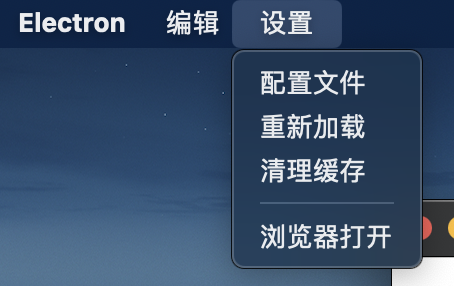

# oneTab  练手产品

设置=>点击配置文件,填写对应的设置, 然后重启软件即可


```
{
    "proxy":"http://127.0.0.1:7890",// 代理服务器,
    "url":"https://chat.openai.com/chat",//打开的网页
    "size":[800,600],//窗口大小
    "hotkey":"CommandOrControl+Shift+o"//快捷键
}
```

macos

```
~/Library/Application Support/oneTab/config.txt

{
    "proxy":"http://127.0.0.1:7890",
    "url":"https://chat.openai.com/chat",
    "size":[800,600],
    "hotkey":"CommandOrControl+Shift+o"
}
```
